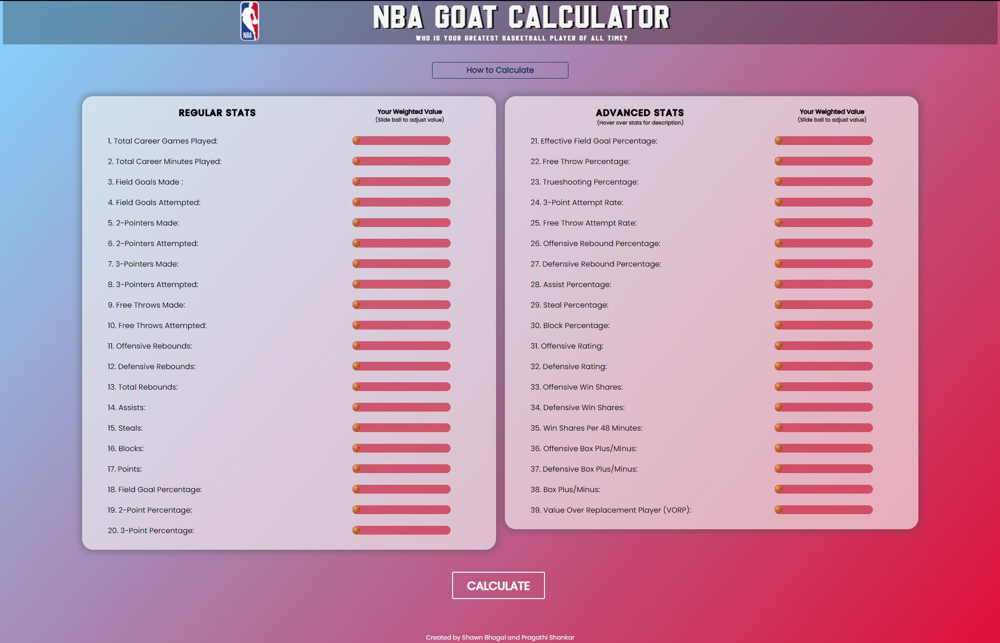

# NBA_GOAT_Project
### [nbagoatcalc.com](nbagoatcalc.com)

## Description:
Inspired by the never ending discourse of who is the greatest player of all time in the NBA, this project was created as a tool for passionate sportsfans who want to settle the controversy once and for all.

This website allows any user to choose from a wide variety of NBA player statistics. Depending on how much the user values each unique stat, they can choose a number from 1 (least important) to 10 (most important) to rank each statistical category.

Once the user has customized rankings to their liking, they can proceed to the calculate button. It will then run the numbers through a comprehensive formula designed to output each players ranking according to the users customizations. 

If satisfied, the user can start from the beginning, or tweak a few of their choices and re-calculate until they get the results they like.

Enjoy and thank you for visiting!

 -- Shawn Bhogal and Pragathi Shankar 
 
## Screenshots: 



## In order to run program:
1) install python3
2) install flask
3) install postgresql  
4) install psycopg2 


## For GCP VM:
To start
```
$ sudo nohup python3 server.py

To stop
```
$ ps -ef | grep server.py
$ kill -9 {PID}
```


## Known Errors:
1) ImportError: No module named psycopg2

Solution:
```
$ env LDFLAGS="-I/usr/local/opt/openssl/include -L/usr/local/opt/openssl/lib" pip install psycopg2 --user
```
